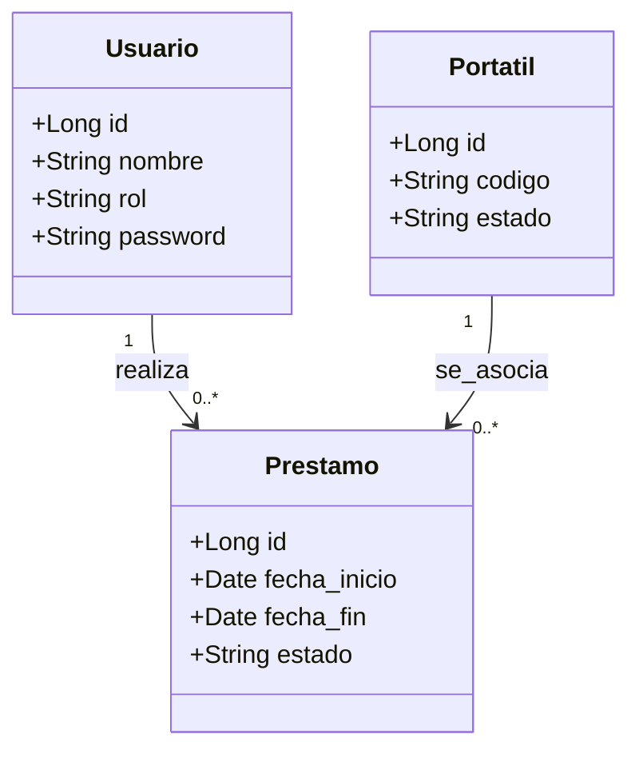

### Diagrama de Casos de Uso del Sistema de Préstamos

El diagrama de clases representa la estructura estática del sistema de gestión de préstamos de portátiles, mostrando las principales entidades del dominio y sus relaciones. El sistema está compuesto por las clases Usuario, Portátil y Préstamo.

 La clase Usuario contiene la información básica del usuario del sistema, incluyendo su identificador, nombre, contraseña y rol, que permite diferenciar entre alumno y administrador dentro de la misma entidad.
 
  La clase Portátil representa los dispositivos disponibles para préstamo, incluyendo su identificador, código único y estado de disponibilidad.
  
   La clase Préstamo actúa como entidad central del sistema, ya que relaciona a los usuarios con los portátiles y almacena la información relativa a cada operación, como las fechas de inicio y fin y el estado del préstamo. 
   
   Las relaciones entre clases permiten reflejar que un usuario puede realizar múltiples préstamos y que cada portátil puede estar asociado a diferentes préstamos a lo largo del tiempo, lo que permite conservar el historial completo del sistema.

