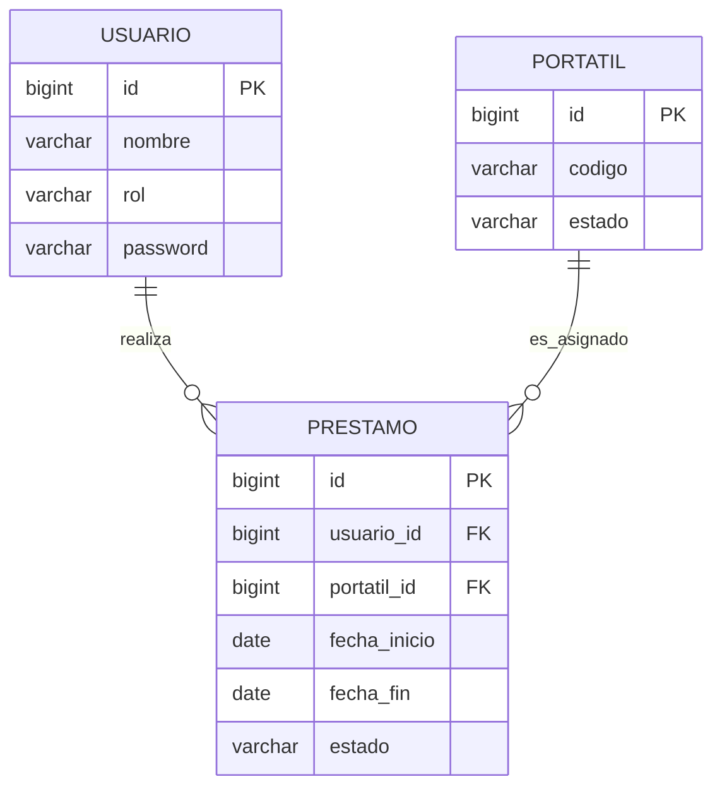

El modelo entidad–relación del sistema representa la gestión de préstamos de portátiles entre usuarios y dispositivos. 

La entidad principal es Préstamo, que actúa como tabla intermedia entre Usuario y Portátil, permitiendo registrar qué usuario solicita cada dispositivo y en qué periodo. 

Cada usuario puede realizar múltiples préstamos, mientras que cada portátil puede estar asociado a distintos préstamos a lo largo del tiempo, lo que permite conservar el historial completo.

 Además, el estado del usuario se gestiona mediante un atributo de rol, diferenciando entre alumno y administrador dentro de la misma entidad.

