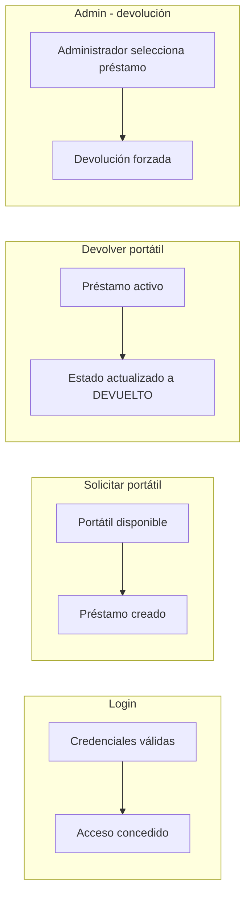

El diagrama de casos de prueba representa el conjunto de escenarios utilizados para validar el correcto funcionamiento del sistema de gestión de préstamos de portátiles.

 Cada caso de prueba define una acción concreta, junto con las condiciones de entrada y el resultado esperado, permitiendo comprobar que las funcionalidades del sistema se comportan según lo especificado. 
 
 Estos casos cubren operaciones como el inicio de sesión, la solicitud y devolución de portátiles, la consulta del historial y las acciones administrativas, garantizando así la fiabilidad y consistencia del sistema en distintos flujos de uso.

